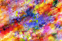

# EchoCrypt - Image to Music Encryption

## About
**EchoCrypt** is an innovative tool that transforms images into music for cryptographic encoding and allows for seamless decryption back into images. This project showcases an unconventional yet fascinating approach to encryption through sound.

## How It Works
The core functionality lies in converting an image into a MIDI file and vice versa. Users interact with a simple Python GUI to encode and decode data effortlessly.

## Instructions

The main program can be accessed via `ui.py`.
- **To encode an image**: Select an image file and click *Convert*. Once processed, save the generated MIDI file.
- **To decode a MIDI file**: Select the MIDI file, click *Convert*, and save the reconstructed image.

Demo video:

## Examples
Input | MIDI Output | Reconstructed Image
------|------------|--------------------
 | [Burst MIDI](output/Abstract_Burst.mid) | 
 | [Fluid MIDI](/output/Abstract_Fluid.mid) | 

Note: Original images are downscaled to 500px width, and the generated images are upscaled to 200px width.

## Technical Breakdown

The **image-to-music** algorithm follows these steps:
1. Load the image from the file.
2. Resize the image to a user-defined resolution (default: 64x64). Higher resolutions yield longer compositions.
3. Extract the RGB channels:
   - **Blue channel**: Determines pitch by mapping values to musical notes.
   - **Green channel**: Defines note duration (scaled between 0.25 and 2.00 quarter-notes).
   - **Red channel**: Controls volume (scaled between 20 and 127 MIDI velocity levels).
4. Chords are generated following Baroque chord progression rules, using a user-defined key.
5. The final MIDI file is generated with structured musical elements.

The **music-to-image** algorithm reverses the process:
- It extracts pitch, duration, and volume from the MIDI file to reconstruct the image data.

## Future Enhancements
While this project provides a unique way to encode images in sound, further improvements could make it even more robust:
- **Steganography**: Concealing image data within an actual song instead of a structured MIDI file.
- **Improved Compression**: Enhancing the conversion algorithm to retain finer image details.
- **Optimized GUI**: A more polished and intuitive user interface.
- **Faster Processing**: Handling larger resolutions more efficiently.
- **Advanced Encryption**: Incorporating metadata and file-specific encryption layers.

## Author
Developed by **Sreevallabh Kakarala**, this project was created to explore the intersections of cryptography, music, and image processing. Feel free to contribute or explore the project further!